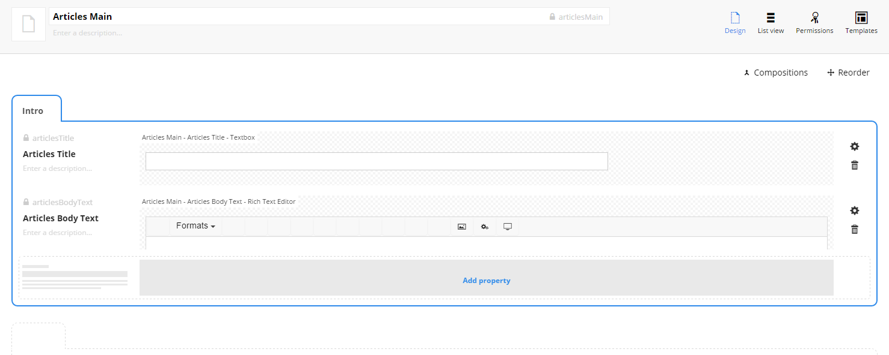
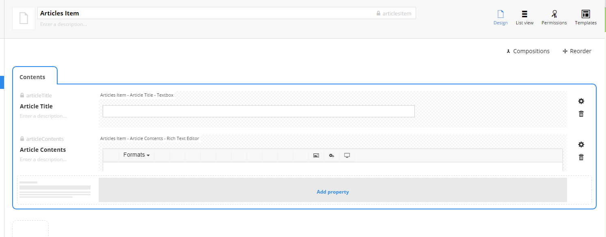
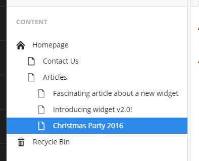
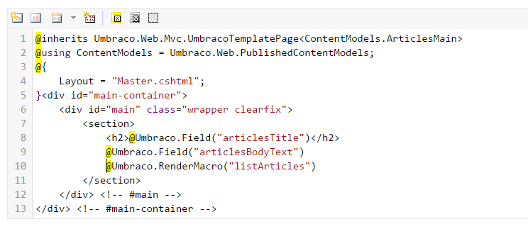
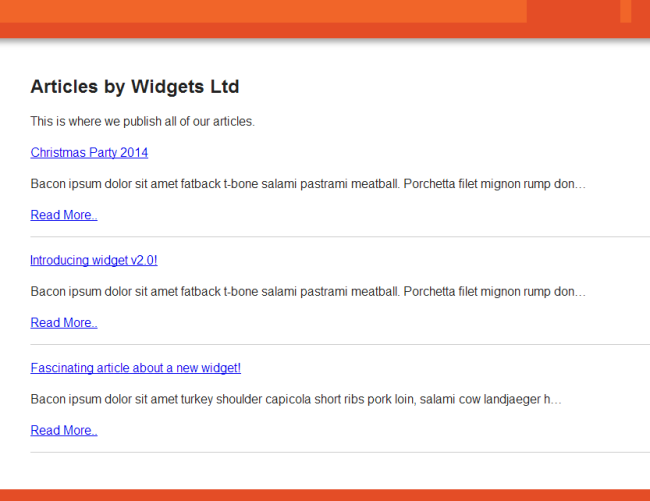

# Articles Parent and Article Items - A Parent Page with Infinite Children

Having an Articles Parent page, and a number of associated child articles which the editors can add to freely, provides a good example page of the power of Umbraco. We'll assume our fictional company, Widgets Ltd, write about ten articles a month and want the articles page to act like a blog (e.g. you could use this functionality for a blog or news and events pages).


Create two new Document Types "_Articles Main_" and "_Articles Item_" **_Document Types Settings > Document Types (hover) > ... > + Create_**. Remember to use the option that creates the template for you.


Create the following **_Tabs_** and **_Data Properties_**:
#### Articles Main
>Tab = Intro


>**"Articles Title"** - Type = Textbox


>**"Articles Body Text"** - type = Rich Text Editor**





*Figure 38 - Articles Main Document Type Data Properties*


#### Articles Item
>Tab = Contents


>**"Article Title"** - Type = Textstring


>**"Article Contents"** - type = Rich Text Editor**





*Figure 39 - Article Item Document Type Data Properties*


Now go to the **_Settings > Document Types >Articles Main node > Permissions screen > Allowed child nodetypes_** and add **_Articles Item_**. This allows us to create items under the main (which acts as a parent container).

We also need to allow the **_Articles Main node_** to be created under the **_Homepage node_**. Do this in the **_Settings > Document Types > Homepage node > Permissions screen >  Allowed child node types_**. Don't add the **_Articles Item_**, only the main should be allowed at this level.


Now go to **_Content > Homepage node (hover)> ..._** and create a node called "_Articles_" of type **_Articles Main_** (if you don't have this option go back and check your allowed child nodes - did you forget to click **_Save_**)?  Give the Articles node some content and a title and then create a couple of article item content nodes under this node (**_Content > Homepage node > Articles node (hover) >  ..._**


Now you should have a content tree that looks like the image below (obviously with your own page node names).  Let's go update our templates we created (automatically when we created the Document Types). First, update them to use the Master as a parent **_Settings > Templates > Articles Main node > Properties tab > Master template dropdown_** = "Master" - do the same for the Articles Item remembering to click **_Save_**.





*Figure 40 - Content Tree With Articles*

<!-- vale valeStyle.Hyperbolic = NO -->

Copy the template content from the **_Simple Content Page_**  template and paste this into both the Articles Item and Articles Main (you may need to refresh the nodes again to see these. Set the Master template to be "Master" and then replace the Page field tags with the relevant  properties e.g. **_articlesTitle_** and **_articlesBodyText_** for the **_Articles Main_** and the **_articleTitle_** and **_articleContents_** for **_Article Item_**.

<!-- vale valeStyle.Hyperbolic = YES -->

>Take care when copying not to overwrite the first line `@inherits Umbraco.Web.Mvc.UmbracoTemplatePage<ContentModels.ArticlesMain>` - if get an exception when loading the page about not being able to bind to source ensure the last part in < > brackets matches your Document Type Alias.

If we now go and check our Articles Main page in the browser we should see our content. We'd like to list the child article items under the intro content so that our visitors can see a list of our articles. Umbraco makes this possible for us, we need to use a bit of Razor.


Click on the **_Developer_** menu from the left-hand side menu and then hover over the **_Partial View Macros Files node_** to get the more menu **_..._** then **_click + Create_**. Name this "_listArticles_" and select the "_List Child Pages Ordered By Date_" in the **_Choose a snippet_** field and click **_Create_**.


Now all we have to do is wire up the Articles main page to list our child articles. Edit the Articles Main template **_Settings > Templates node > Master node > Articles Main node > Template tab_**.  Under the *articlesBodyText* tag enter a carriage return and then click the **_Insert Macro_** button, choose the ListArticles macro we created and then click **_Save_**.





*Figure 41 - Template for Articles Parent with the Macro Code*


Check what we have on our **_Articles_** page now - we're really getting somewhere!  Let's make it a bit more real world. I'll leave the understanding of this to Razor lessons / The Umbraco videos but it will finish our site off nicely. Edit the Partial you created, **_Developer > Partial View Macro Files > listArticles.cshtml_** and change the content to be:


```csharp
@inherits Umbraco.Web.Macros.PartialViewMacroPage
@{
    var selection = CurrentPage.Children.Where("Visible").OrderBy("CreateDate desc");
    @* OrderBy() takes the property to sort by and optionally order desc/asc *@
}

@foreach (var item in selection)
{
<div class="article">
        <div class="articletitle"><a href="@item.Url">@item.Name</a></div>
        <div class="articlepreview">@(Umbraco.Truncate(item.GetPropertyValue<string>("articleContents"), 100)) <a href="@item.Url">Read More..</a></div>
    </div>
    <hr/>
}
```

*Figure 42 - Improved Macro for listArticles*


Now check this in the browser!





*Figure 43 - Finished Articles Page*


---
## Next - [Conclusions and Where Next?](../Conclusions-Where-Next)
By this point you'll have a basic working site - where next?  You've barely scratched the surface of the power of Umbraco!
