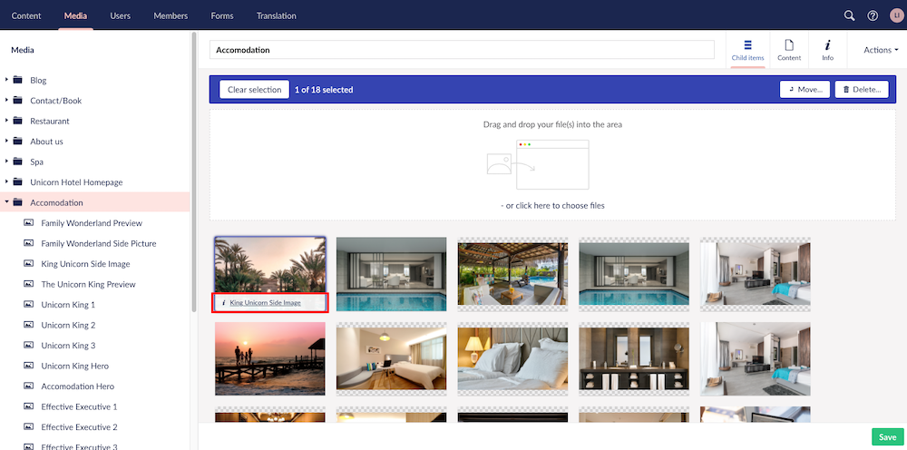

# SEO for images

In Umbraco you have a media library for all of your images, videos and files. To make it easy for you to follow accessibility and SEO best practices you can add an **alternative text** to all images you upload.

Adding an alternative text will give website visitors using screen readers as well as search engine crawlers a description of what is on the image. This makes your website accessible as well as improve your image SEO.

The alternative text is added as the `` attribute for the image whenever it is uploaded to a page.

Below is a guide on how to add an alternative text to an image:

1. Go to the **Media** section
2. Navigate to an image in a folder
3. Click on the name of the image to open it

    

4. Fill out the **Alternative Text** field
5. Click save

Now you can add the image to your pages and the Alternative Text will be automatically added as the `` attribute.

:::note
When you add an image using the Rich Text Editor you will be asked to fill out an alternative text when you are adding the image.

That does not automatically fill out the `` attribute and you will need to write it in the **Alternative text (optional)** field when adding the image.
:::
